# 导弹制导律验证程序 - 函数关系流程图

## 系统架构概览

本程序采用模块化设计，主要包含以下核心模块：

1. **App.jsx** - 主应用组件，协调所有子组件
2. **SimulationControl** - 仿真控制面板，收集用户输入
3. **SimulationEnv** - 仿真环境，控制仿真循环
4. **GuidanceLaw** - 制导律模块，计算制导指令
5. **MissileModel** - 导弹运动学模型
6. **TargetModel** - 目标运动学模型
7. **Visualization** - 可视化组件，显示仿真结果
8. **ResultsDisplay** - 结果显示组件

---

## 主流程图

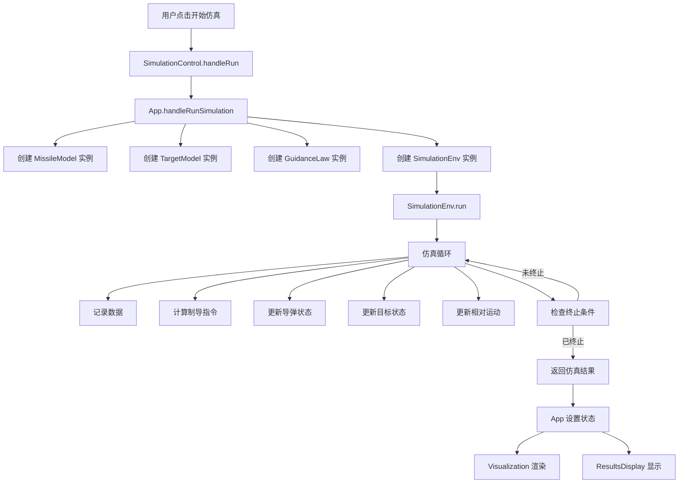

---

## SimulationEnv 详细流程图

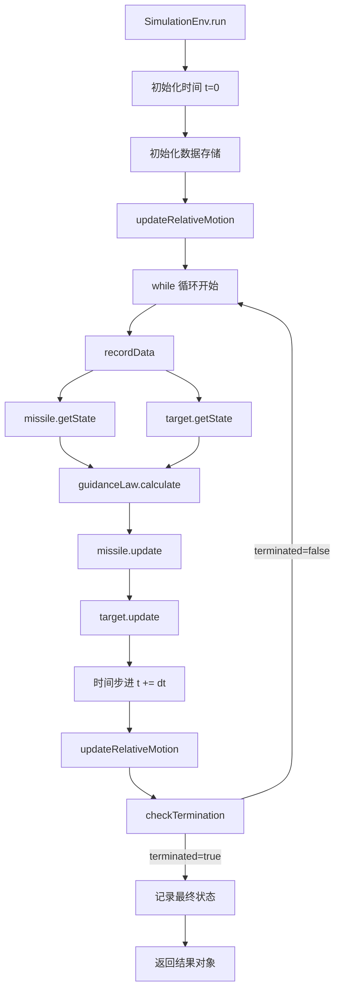

### updateRelativeMotion 函数流程

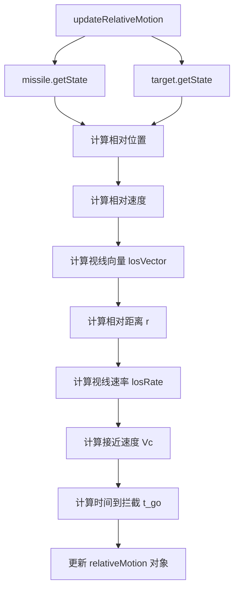

---

## GuidanceLaw 详细流程图

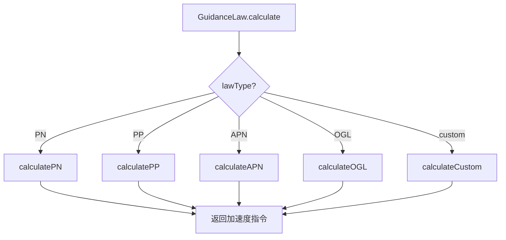

### calculatePN 流程（含物理补偿）

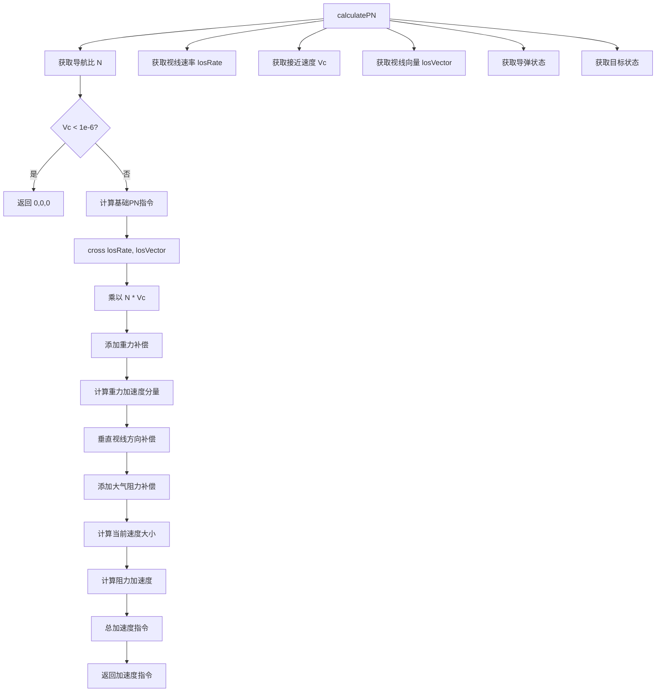

### calculateCustom 流程

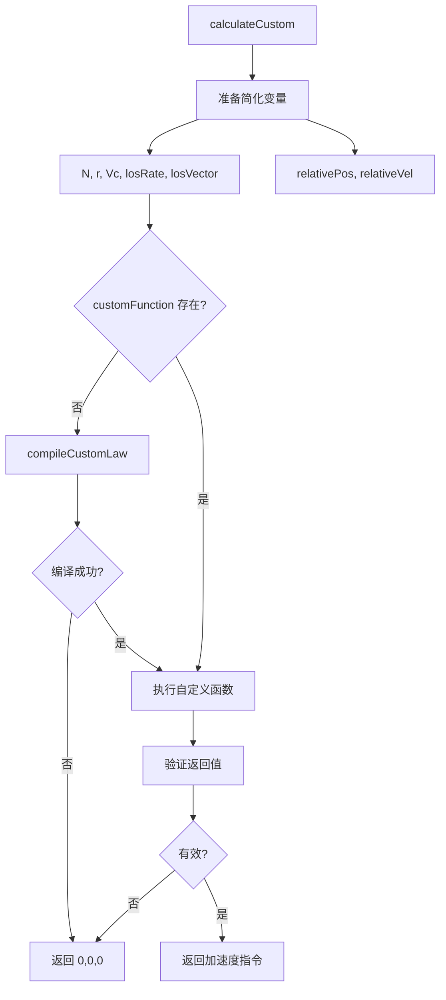

### compileCustomLaw 流程

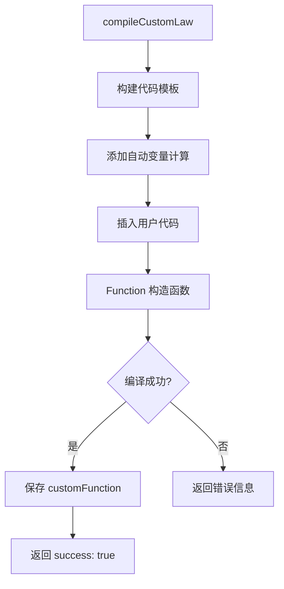

---

## MissileModel 详细流程图（含物理模型）

```mermaid
graph TD
    A[missile.update] --> B[获取当前速度大小]
    B --> C[计算速度方向]
    C --> D[获取制导指令]
    
    D --> E[限制制导指令到最大加速度]
    E --> F[计算总加速度]
    
    F --> G[添加重力加速度]
    G --> H[计算重力分量 g = [0, -9.81, 0]]
    
    H --> I[计算大气阻力]
    I --> J[计算动态压力 q = 0.5 * ρ * v²]
    J --> K[计算阻力系数 Cd]
    K --> L[计算阻力面积 S]
    L --> M[阻力加速度 = -Cd * S * q / m]
    
    M --> N[计算推力加速度]
    N --> O[获取推力大小]
    O --> P[推力加速度 = thrust / m * 速度方向]
    
    P --> Q[总加速度 = 制导 + 重力 + 阻力 + 推力]
    
    Q --> R[更新速度 v = v + a*dt]
    R --> S{速度 < minVelocity?}
    S -->|是| T[限制到最小速度]
    S -->|否| U[更新位置 p = p + v*dt]
    T --> U
    
    U --> V[更新姿态 attitude = normalize v]
    V --> W[计算当前马赫数]
    W --> X[更新空气动力学参数]
    
    X --> Y[返回 this]
```

---

## TargetModel 详细流程图（增强机动模式）

```mermaid
graph TD
    A[target.update] --> B[时间步进 t += dt]
    B --> C{motionType?}
    
    C -->|constant| D[匀速直线运动]
    D --> E[加速度 = 0,0,0]
    
    C -->|circular| F[圆周运动]
    F --> G[计算角速度 ω]
    G --> H[计算向心加速度]
    H --> I[加速度 = [-rω²cosθ, -rω²sinθ, 0]]
    
    C -->|sine| J[正弦机动]
    J --> K[计算振幅 A]
    K --> L[计算频率 f]
    L --> M[加速度 = [A*sin(2πft), A*cos(2πft), 0]]
    
    C -->|random| N[随机机动]
    N --> O[生成高斯随机数]
    O --> P[平滑滤波]
    P --> Q[加速度 = [randX, randY, randZ]]
    
    C -->|evasive| R[智能规避]
    R --> S[检测导弹接近]
    S --> T[计算威胁方向]
    T --> U[生成垂直于威胁方向的机动]
    U --> V[加速度 = 规避指令]
    
    C -->|zigzag| W[之字形机动]
    W --> X[计算转向点]
    X --> Y[切换加速度方向]
    Y --> Z[加速度 = ±[maxAccel, 0, 0]]
    
    C -->|spiral| AA[螺旋机动]
    AA --> AB[计算螺旋参数]
    AB --> AC[加速度 = 螺旋轨迹加速度]
    
    E --> AD[更新速度 v = v + a*dt]
    I --> AD
    M --> AD
    Q --> AD
    V --> AD
    Z --> AD
    AC --> AD
    
    AD --> AE[更新位置 p = p + v*dt]
    AE --> AF[返回 this]
```

---

## Visualization 组件流程图

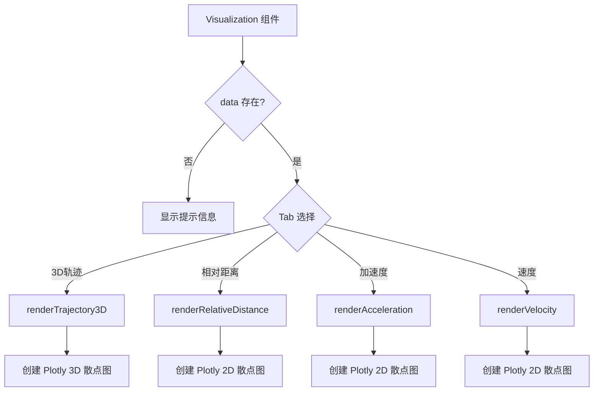

---

## 数据流向图

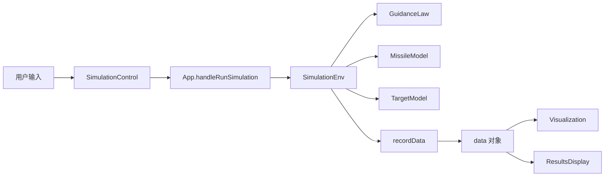

---

## 函数调用关系表

| 调用者 | 被调用函数 | 说明 |
|--------|-----------|------|
| App | MissileModel | 创建导弹模型实例 |
| App | TargetModel | 创建目标模型实例 |
| App | GuidanceLaw | 创建制导律实例 |
| App | SimulationEnv | 创建仿真环境实例 |
| SimulationEnv.run | missile.getState | 获取导弹状态 |
| SimulationEnv.run | target.getState | 获取目标状态 |
| SimulationEnv.run | guidanceLaw.calculate | 计算制导指令 |
| SimulationEnv.run | missile.update | 更新导弹状态 |
| SimulationEnv.run | target.update | 更新目标状态 |
| SimulationEnv.run | updateRelativeMotion | 更新相对运动 |
| SimulationEnv.run | recordData | 记录数据 |
| SimulationEnv.run | checkTermination | 检查终止条件 |
| GuidanceLaw.calculate | calculatePN | 计算比例导引 |
| GuidanceLaw.calculate | calculatePP | 计算纯追踪 |
| GuidanceLaw.calculate | calculateAPN | 计算扩展比例导引 |
| GuidanceLaw.calculate | calculateOGL | 计算最优制导律 |
| GuidanceLaw.calculate | calculateCustom | 计算自定义制导律 |
| calculateCustom | compileCustomLaw | 编译自定义代码 |
| MissileModel.update | limit | 限制向量大小 |
| MissileModel.update | normalize | 归一化向量 |
| TargetModel.update | - | 根据运动类型更新 |

---

## 关键数据结构

### SimulationEnv.data
```javascript
{
  time: [],                    // 时间序列
  missilePosition: [[], [], []],  // 导弹位置 [x, y, z]
  targetPosition: [[], [], []],   // 目标位置 [x, y, z]
  missileVelocity: [[], [], []],  // 导弹速度 [vx, vy, vz]
  targetVelocity: [[], [], []],   // 目标速度 [vx, vy, vz]
  missileAcceleration: [[], [], []], // 导弹加速度 [ax, ay, az]
  relativeDistance: [],        // 相对距离
  closingVelocity: []          // 接近速度
}
```

### relativeMotion
```javascript
{
  relativePosition: [rx, ry, rz],    // 相对位置
  relativeVelocity: [vx, vy, vz],    // 相对速度
  losVector: [nx, ny, nz],           // 视线向量（归一化）
  losRate: [wx, wy, wz],             // 视线速率
  closingVelocity: Vc,                // 接近速度
  timeToGo: t_go,                    // 时间到拦截
  relativeDistance: r                // 相对距离
}
```

### missileState / targetState
```javascript
{
  position: [x, y, z],      // 位置
  velocity: [vx, vy, vz],  // 速度
  acceleration: [ax, ay, az], // 加速度
  speed: V                 // 速度大小（仅导弹）
}
```

---

## 仿真循环时序图

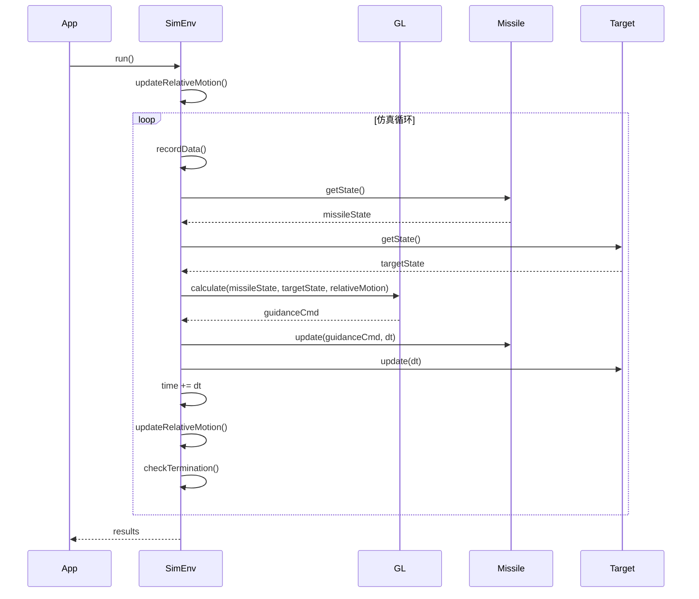

---

## 自定义制导律执行流程

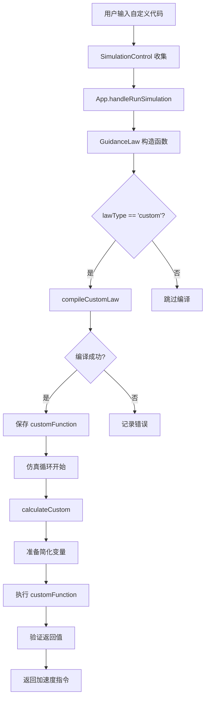

---

## 总结

本程序采用清晰的模块化架构，各模块职责明确：

1. **App.jsx** - 应用主控制器，协调各组件
2. **SimulationControl** - 用户界面，收集参数
3. **SimulationEnv** - 仿真引擎，控制循环
4. **GuidanceLaw** - 制导算法，计算指令
5. **MissileModel** - 导弹模型，更新状态
6. **TargetModel** - 目标模型，更新状态
7. **Visualization** - 可视化展示
8. **ResultsDisplay** - 结果统计

数据流向清晰：用户输入 → 仿真计算 → 数据记录 → 可视化展示
